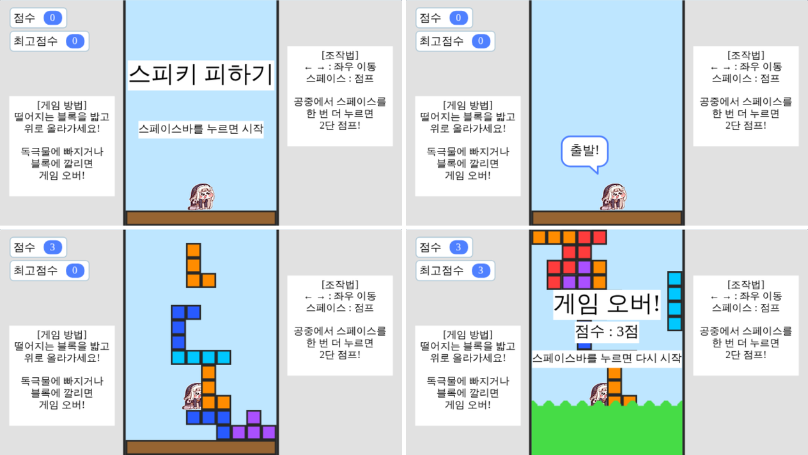

# 스피키 피하기 — 엔트리 게임



위에서 떨어지는 테트로미노에 **깔리지 않게 피하고**, 블록을 **밟고 올라가는** 세로형 게임입니다.
아래에서는 초록색 **독극물이 천천히 차오르기** 때문에 계속 위로 올라가야 해요.

- 작품 파일: **[`tetro_climb.ent`](tetro_climb.ent)** (이 파일 하나만 있으면 됩니다)
- 엔트리 무대 가운데에 폭 10칸짜리 경기장이 있고, 왼쪽에 점수·게임 방법, 오른쪽에 조작법이 있습니다.

## 여는 방법

| 어디서 | 방법 |
| --- | --- |
| **엔트리 오프라인 (PC)** | 위쪽 메뉴의 **오프라인 작품 불러오기** → `tetro_climb.ent` 선택 (파일을 더블클릭해도 열립니다) |
| **playentry.org** | 로그인 → **만들기 → 작품 만들기** → 위쪽 메뉴의 **오프라인 작품 불러오기** → `tetro_climb.ent` 선택 |

불러온 뒤 **▶ 시작하기**를 누르고, **스페이스바**를 누르면 게임이 시작됩니다.
(키보드로 조작하는 게임이라 PC에서 해 주세요.)

## 조작법

| 키 | 동작 |
| --- | --- |
| ← → | 좌우 이동 |
| 스페이스바 (또는 ↑) | 점프 (약 3.4칸) |
| 공중에서 스페이스바 한 번 더 | **2단 점프** (두 번 합치면 약 6칸) |
| 스페이스바 | 게임 오버 후 다시 시작 |

## 규칙

- 블록은 떨어지는 중에도 **단단한 물체**예요. 옆에서 부딪히면 막히기만 하고, 위에 올라타면 같이 내려가며, 그 위에서 점프도 할 수 있어요.
- **깔리면 게임 오버**: 바닥(또는 쌓인 블록)에 서 있는데 떨어지는 블록이 몸의 절반 넘게 덮치면 끼여서 끝나요. 살짝만 걸치면 옆으로 밀려나요.
- **내려앉은 블록**은 발판입니다. 한 번 점프로 3칸, 2단 점프로 6칸 정도까지 오를 수 있어요.
- 블록 30%는 플레이어 머리 위를 노리고 떨어집니다. 가만히 있으면 위험해요!
- **독극물**은 처음엔 아주 느리게, 시간이 지날수록 빨라집니다. 너무 앞서가도 화면 아래까지 따라붙어요.
- `점수`는 올라간 최고 높이(칸 수), `최고점수`는 지금까지의 최고 기록입니다 (무대 왼쪽 위 변수 창).
- 캐릭터 그림(높이 33px)은 실제 판정(가로·세로 14px)보다 커요. 머리카락이나 모자가 블록에 겹쳐도 괜찮아요.

## 작품 구성

| 오브젝트 | 하는 일 |
| --- | --- |
| 게임 관리자 | 게임 전체 흐름(시작 → 게임 → 게임 오버)과 **매 프레임 물리 계산**을 담당 (무대에는 안 보임) |
| 제목 글상자 / 점수 글상자 / 안내 글상자 | 시작 화면과 게임 오버 화면의 글자 |
| 게임 방법 / 조작법 | 양옆에 있는 설명 글상자 |
| 독극물 | 아래에서 올라오는 초록 독극물 |
| 블록 | 원본은 블록을 고르고 복제본을 만들며, **복제본 하나 = 테트로미노 하나**. 떨어지는 동안 플레이어를 밀어내고, 내려앉으면 발판이 됨 |
| 플레이어 | 캐릭터 그림. 계산된 위치로 움직이고, 누른 방향키 쪽을 보도록 모양(오른쪽/왼쪽)을 바꾸며, 시작할 때 "출발!", 게임 오버 때 "으악!" 이라고 말함 |
| 바닥, 배경 | 맨 아래 바닥, 전체 배경 |

## 코드가 동작하는 방식 (공부용)

1. **격자 리스트**: 블록이 쌓인 칸을 `격자` 리스트에 0/1 로 기록합니다. 한 줄은 12칸(양 끝 두 칸은 보이지 않는 벽), 줄 번호는 아래에서부터 셉니다.
   엔트리 리스트는 최대 5000개까지만 담을 수 있어서 **96줄짜리 순환 버퍼**로 씁니다 (`(줄 번호 ÷ 96의 나머지) × 12 + 칸 번호 + 1` 번째 항목).
2. **충돌 판정은 계산으로**: `~에 닿았는가?` 블록 대신, 플레이어의 네모 영역이 걸치는 칸만 격자에서 확인합니다. 그래서 정확하고 빠릅니다.
3. **반복 없이 한 프레임**: 엔트리의 반복 블록은 한 바퀴마다 한 프레임씩 쉬기 때문에, 매 프레임 계산은 반복문 없이 `만일`과 **함수**로만 만들었습니다.
   게임 관리자의 메인 반복 한 바퀴가 곧 한 프레임입니다.
   - `키 입력 처리` → `좌우로 움직이기` → `점프와 중력` → `점수와 카메라` → `독극물 올리기` → `위쪽 줄 미리 만들기`
   - 떨어지는 블록 복제본은 자기 네 칸마다 `플레이어 밀어내기`를 불러 가장 조금 움직이는 방향(위/아래/왼쪽/오른쪽)으로 플레이어를 밀어내고, `끼임 검사`로 밀려난 자리가 막혀 있으면 게임 오버로 만듭니다.
4. **카메라**: 모든 오브젝트는 "월드 높이 − 카메라Y" 위치에 그려집니다. 플레이어가 올라가면 `카메라Y`가 따라 올라가 화면이 위로 스크롤됩니다.
5. **블록 생성**: 새 블록은 떨어질 세로줄들의 쌓인 높이(`열높이` 리스트)보다 위, 화면 바로 위쪽에서 생깁니다. 내려앉을 때 네 칸을 격자에 기록하고, 독극물에 잠긴 블록 복제본은 스스로 삭제됩니다.

## 난이도 바꾸기

| 바꾸고 싶은 것 | 위치 | 기본값 |
| --- | --- | --- |
| 독극물 속도 | 함수 `독극물 올리기` 첫 줄: `0.06 + 프레임 ÷ 90000` (최대 0.32) | 1초에 약 3.6px에서 시작 |
| 독극물 시작 높이 | 함수 `게임 변수 초기화`의 `독극물Y` | -45 |
| 블록 낙하 속도 | `블록` 오브젝트: `낙하속도 = 1.5 + 프레임 ÷ 10000` (최대 2.8) | 1.5 |
| 블록이 생기는 간격 | `블록` 오브젝트: `다음생성거리 = 115 − 프레임 ÷ 300` (최소 90) + 0~24 | 약 1.4초마다 |
| 플레이어를 노리는 블록 비율 | `블록` 오브젝트: `1부터 100 사이의 무작위 수 ≤ 30` | 30% |
| 이동 속도 | 함수 `키 입력 처리`의 `속도X = 2.4` | 2.4 |
| 점프 힘 / 2단 점프 힘 / 중력 | 함수 `키 입력 처리`의 `속도Y = 7.6`, `7.0`, 함수 `점프와 중력`의 `0.44` | 7.6 / 7.0 / 0.44 |
| 깔림 판정 너그러움 | 함수 `플레이어 밀어내기`의 `밀왼(밀오른) < 8` (이보다 적게 걸치면 옆으로 밀려남) | 8px |

## 다시 생성하기 (선택)

`tetro_climb.ent`는 `tools/` 폴더의 파이썬 코드로 그림·효과음·블록 코드를 모두 생성한 것입니다.

```bash
pip install pillow numpy lameenc
python3 tools/build_tetro_climb.py      # → tetro_climb.ent
```

- `tools/build_tetro_climb.py` — 오브젝트, 변수, 함수, 블록 코드를 조립해 `.ent`(tar.gz, 엔트리 오프라인 저장 형식)로 묶음
- `tools/entry_dsl.py` — 엔트리 블록 JSON을 만드는 작은 도우미
- `tools/art.py` — 그림(블록, 플레이어, 독극물, 바닥, 배경)
- `tools/assets/character.png` — 플레이어 캐릭터 그림 (이 파일을 바꾸고 다시 생성하면 캐릭터가 바뀜)
- `tools/sfx.py` — 효과음(점프, 게임 오버)
